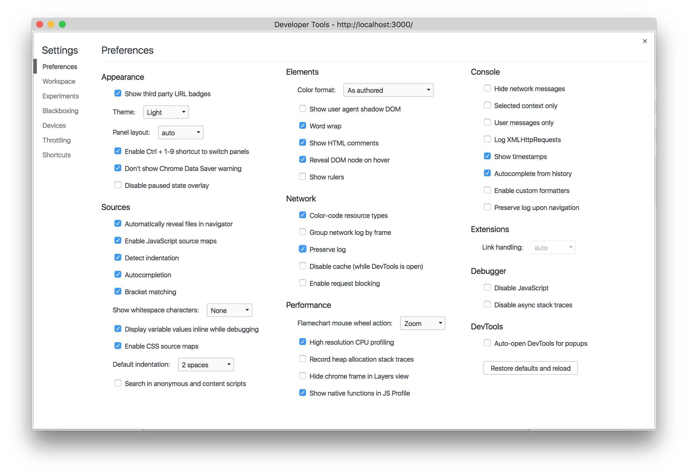
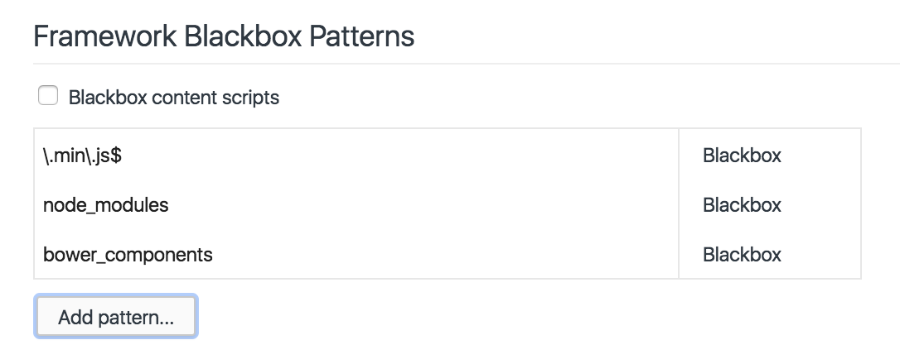
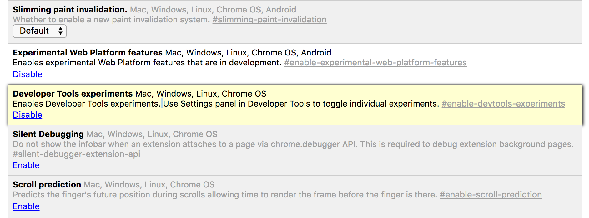
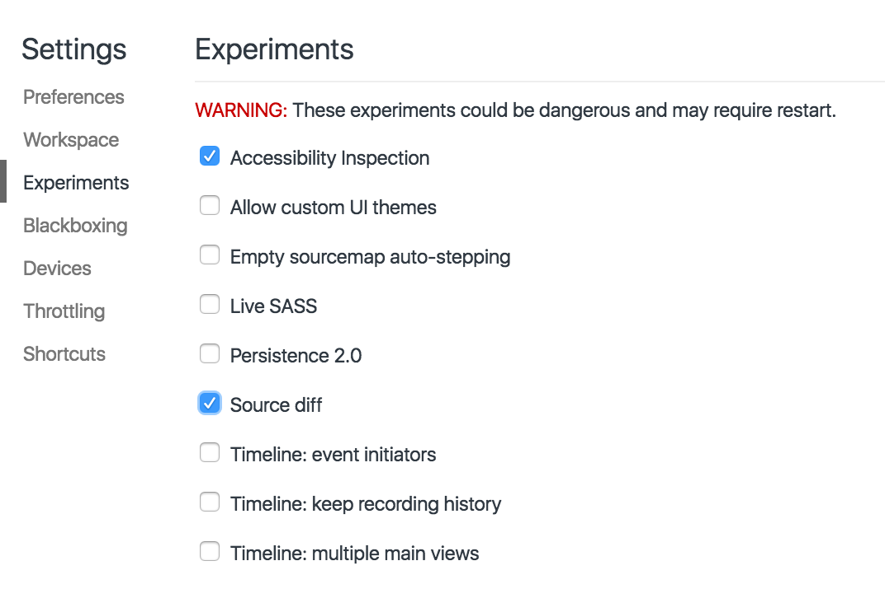

# Devtools Workshop
### DinosaurJS: June 16th, 2017 

This is a purposefully terribly-built application for the sake of demonstrating how to use Chrome's Developer Tools to debug even the gnarliest of codebases. Please do not use it as a reference for best practices and do not file issues or pull requests to improve it. IT IS BEAUTIFUL JUST THE WAY IT IS.

### Outline
1) Setup & Configuration
2) Devtools for Debugging
3) Devtools for Workflow

## Setup & Configuration

### 1) Install [Chrome Canary](https://www.google.com/chrome/browser/canary.html)

Canary is a more beta release of the Chrome browser. It comes with the most bleeding-edge features that will eventually be released to the standard Chrome browser. Using Canary will allow us to play with new dev tools features before they are released.

### 2) Clone This Practice Repo:

```bash
git clone https://github.com/brittanystoroz/dino-devtools.git 
npm install
webpack --watch
npm start
```

You should then see the app running on localhost:3000.

### 3) Configure Your Dev Tools Settings

The bulk of your dev tools settings will exist under the 'Preferences' tab. The configuration I prefer to use looks like the following: 



Another helpful setting to configure is 'Blackboxing'. Blackboxing allows you to ignore certain types of files (like library or framework code) when debugging. A simple blackboxing configuration might look like this:




We'll also want to turn on some experimental features. Navigate to [chrome://flags](chrome://flags) and find the 'Developer Tools experiments' section. Click the 'Enable' link.



Back in our dev tools settings, let's turn on the following experiments:




## Devtools for Debugging

### Elements & Styles
### Console
### Sources
### Network
### Audits
### Application


## Devtools for Workflow

### Changes Drawer
### Persistence 2.0
### Terminal Access